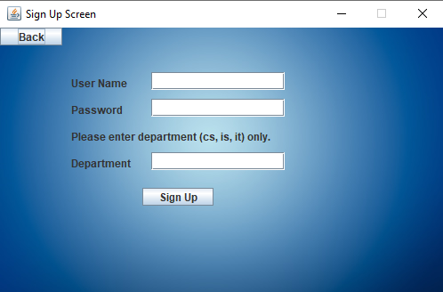

# University Registration System
<ul>
	<li>written in Java programming language.</li>
	<li>using an object-oriented approach.</li>
	<li>connect with SQLite database.</li>
	<li>view by Java Swing User Interface.</li>
</ul>

### Main functionality: Add | Details | Updates	
<ul>
	<li>Adding new teachers.</li>
	<li>Adding new students.</li>
	<li>Adding student degrees.</li>
	<li>Showing total degree(sum of assignment, mid and final exam) & print it.</li>
	<li>Updating student information.</li>
	<li>Updating student degrees.</li>
</ul>
All teachers, students, and degrees insert into a <b>database</b>.
 

<h4>System view using NetBeans IDE</h4>

